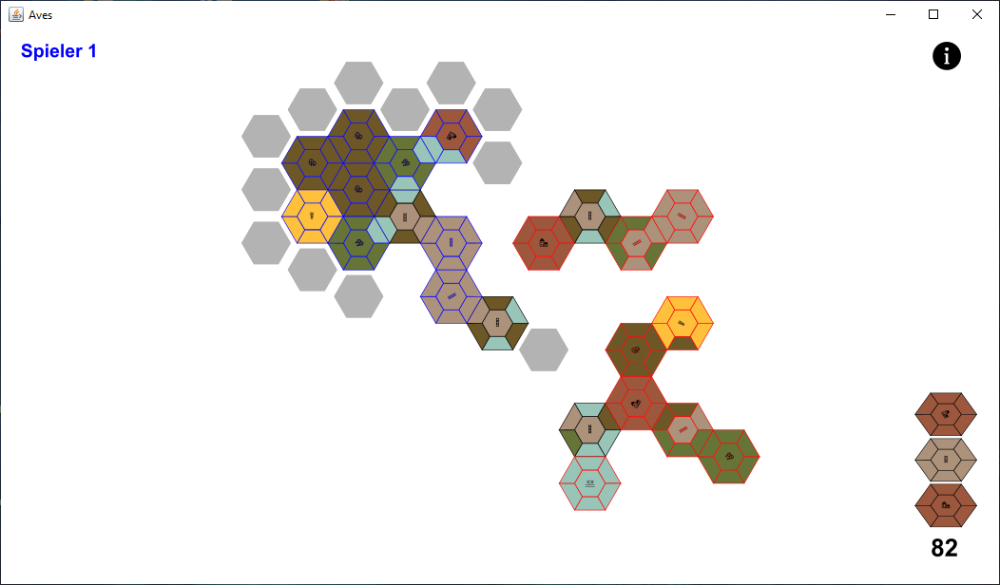
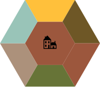
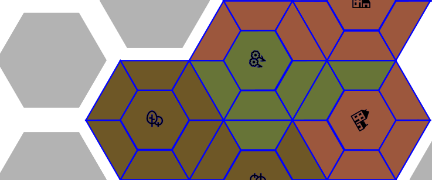

# Aves – Abschlussprojekt im Modul Allgemeines Programmierpraktikum

## Projektbeschreibung

Das Projekt **Aves** war das Abschlussprojekt des Uni-Moduls *Allgemeines Programmierpraktikum* im Sommersemester 2022. Es wurde von mir und zwei Mitstudenten innerhalb von **4 Wochen** entwickelt und am Ende mit einer **mündlichen Prüfung** bewertet. Ziel des Projektes war es, ein Computerspiel in Java zu entwickeln, welches bestimmte Vorgaben und Anforderungen eines vorgegebenen Presets umsetzt.<br>
<br>
 Im Spiel erschaffen die Spieler eine Landschaft, indem sie sechseckige Karten auf einem Spielbrett aneinander legen. Wer die Karten möglichst passend aneinander legt erhält die meisten Punkte und gewinnt das Spiel. Das Spielprinzip und die Spielidee waren vorgegeben und sind von den Spielen [Dorfromantik (2022)](https://www.toukana.com/dorfromantik) und [Carcassonne](https://de.wikipedia.org/wiki/Carcassonne_(Spiel)) inspiriert.



## Projektziele

Das Hauptziel des Projekts war es, ein funktionierendes Spiel zu erstellen, welches den Anforderungen des Presets doerfer entspricht. Dies beinhaltete unter anderem:

- Die Implementierung der grundlegenden Spielmechaniken
- Die Implementierung der grafischen Ein-und Ausgabe des Spiels
- Die Implementierung zwei verschiedener Arten von Spielern (HUMAN, RANDOM_AI)
- Die Einhaltung der vorgegebenen Anforderungen und Funktionalitäten
- Ausbauen des Projektes durch optionale Ziele wie: 
    - Hinzufügen von Soundeffekten und Musik 
    - Entwicklung eines Launchers mit dem sich die Einstellungen editieren lassen
    - Anzeige des aktuellen Punktestandes
    - etc.

## Teamarbeit und Aufgabenverteilung
**Simon Sommer**:
- <u>Spielbrettlogik</u>: Entwicklung und Implementierung der Struktur des Spielbretts, einschließlich des Setzens und Speicherns der Karten, sowie der Punkteberechnung.
- <u>Spielkartenlogik</u>: Implementierung der Logik, die den Einsatz und die Verwaltung von Karten im Spiel regelt.
- <u>Koordinaten-Transformation</u>: Umwandlung von Spielbrettkoordinaten in Bildschirmpositionen und die Interaktion des Backends mit den Grafikelementen.
- <u>Packages</u>: doerfer.board, doerfer.card, doerfer.screen, doerfer.exception, doerfer.main

**Lennart S.**: 
- <u>Grafik</u>: Verantwortlich für die grafischen Elemente und die Benutzeroberfläche.
- <u>Listener</u>: Entwicklung von Event-Listenern, die auf Spieleraktionen reagieren (z.B. Mausklicks, Tastatureingaben) und entsprechende visuelle oder logische Reaktionen auslösen.
- <u>Musik</u>: Implementierung der Musik- und Soundeffekte im Spiel.
- <u>Packages</u>: doerfer.screen, doerfer.musik, doerfer.listeners, doerfer.main

**Joshua H.**:
- <u>Spielablauf</u>: Definition und Steuerung des gesamten Spielablaufs. Hier geht es darum, die verschiedenen Phasen des Spiels zu koordinieren, z.B. den Start, die Spiellogik, das Ende und die Übergänge zwischen den Spielzuständen.
- <u>Spielerlogik</u>: Verwaltung der Spieleridentität und Implementierung der verschiedenen Spielertypen.
- <u>Launcher</u>: Erstellung des Launchers, der es dem Spieler erlaubt, das Spiel zu starten und Optionen auszuwählen. 
- <u>Spielkonfiguration</u>: Verwaltung der Konfigurationseinstellungen, durch Laden und Anpassen von Konfigurationsdatein.
- <u>Packages</u>: doerfer.player, doerfer.card, doerfer.configuration, doerfer.exception, doerfer.main  

## Installation
### Systemanforderungen und Abhängigkeiten

- **Benötigter Speicherplatz**: Ca. 38 MB
- **Betriebssysteme**: Windows, macOS, Linux
- **Java**: Version 22 (2024-03-19) 
- **Apache Ant**: Version 1.10.12 (nur für den Build-Prozess)
- **javadoc**: Version 18.0.1.1

### Build-Prozess und Starten des Spiels  
1. Klonen oder laden Sie das Projekt herunter.
2. Navigieren Sie im Terminal zum Verzeichnis des Projekts.

Für den Build folgendes Kommando im Verzeichnis des Projektes starten:
```
ant
```

Um das Spiel zu starten, verwenden Sie den folgenden Befehl im Projektverzeichnis:
``` 
java -jar build/jar/aves.jar
```

Falls Sie die Dokumentation des Projektes erstellen möchten, können Sie dies mit folgendem Befehl tun:
```
ant javadoc
```
Die Dokumentation befindet sich nach dem Ausführen in dem Ordner **build/javadoc**.
### Ohne Build starten (optional)
Falls Sie das Spiel ohne den Build-Prozess mit Apache Ant ausführen möchten, können Sie die bereits erstellte **aves.jar** des aktuellen Builds verwenden. Um das Spiel zu starten, führen Sie einfach die `aves.jar` im Projektverzeichnis aus.

## Bibliotheken
Es werden folgende Bibliotheken verwendet:
  - Das Preset des Projektes **Doerfer-Preset-v1.3.2** steht unter der CC0 1.0 Lizenz.
  - [Apache Commons CLI](https://commons.apache.org/proper/commons-cli/) (1.5.0), welche unter Apache License Version 2.0 veröffentlicht ist.
  - [SVG Salamander](https://github.com/blackears/svgSalamander) (c281ca2), welche unter der BSD Lizenz veröffentlicht ist.
  - Teile der verwendeten Grafiken stammen von [RESHOT - Free SVG Icons](https://www.reshot.com/free-svg-icons/).

## Spielanleitung und Spielablauf
### Spielfeld
Das Spielbrett ist unendlich groß und besteht aus einem Gitter aus Sechsecken, in dem sich die Karten flächendeckend aneinander legen lassen.
### Karten
Eine Karte ist ein Sechseck mit sechs Kanten und einem Mittelpunkt.
Jeder Kante ist einem Biom zugeordnet. Es existieren die folgenden Biomarten: Häuser (rot), Grünland (grün), Wald (braun), Acker (gelb), Zugstrecke (beige), Wasser (blau). Alle Biome sind mit sich selbst und miteinander kompatibel, mit den folgenden Ausnahmen:

  - Wasser ist nur mit Wasser kompatibel.
  - Zugstrecke ist nur mit Zugstrecke kompatibel.




### Spielkonfiguration

#### Standardkonfiguration für zwei Spieler
Das Spiel ist standardmäßig für zwei Spieler konfiguriert. Beim Starten des Spiels über den Launcher wird automatisch diese Standardkonfiguration geladen. Über die Einstellungen im Launcher können weitere Anpassungen vorgenommen werden.

#### Konfiguration für Solo-Spiel oder mehrere Spieler
Für die Konfiguration mit einer anderen Spieleranzahl gibt es vorgefertigte Konfigurationen im **PreSettings**-Ordner. Dieser Ordner enthält vorkonfigurierte Dateien, die die Spielsettings für Solo-Spiele, 2-Spieler-Spiele oder mehr enthalten.

##### Schritte zur Konfiguration

1. **Launcher starten**  
  Starten Sie den Launcher, aber drücken Sie noch nicht auf den Start-Button.


2. **Konfigurationsdateien auswählen**  
  Gehen Sie zum Ordner **PreSettings** im Hauptverzeichnis und kopieren Sie die folgenden beiden Dateien für die gewünschte Spieleranzahl:

  - **Config.txt**  
    Diese Datei enthält die allgemeine Spielkonfiguration in folgender Reihenfolge:
    - Anzahl der Spieler
    - Anzahl der Karten
    - Wahrscheinlichkeiten der Biome bei der Generierung
    - Anzahl der vorplatzierten Karten
    - Format für die vorplatzierten Karten (Format: SPIELERID, REIHE, SPALTE, DREHUNG, BIOM).

  - **Settings.txt**  
    Diese Datei enthält benutzerspezifische Einstellungen:
    - Größe des Spielbretts
    - Startbedingungen
    - Einschalten der Musik (true oder false)
    - Verzögerung des zufälligen Computerspielers (RANDOM_AI) in ms
    - Die Namen der Spieler (z.B. Spieler 1, Spieler 2,...)
    - Die Einstellung für Computerspieler (false) oder menschliche Spieler (true).

    Jede Spieleranzahl hat ihren eigenen Ordner und die entsprechenden Dateien. Die Einstellungen in den Dateien können ebenfalls verändert werden.


3. **Dateien in den Resource-Ordner einfügen**  
  Kopieren Sie die entsprechenden **Config.txt** und **Settings.txt** in den **resources**-Ordner im Hauptverzeichnis des Projektes:

  - Beispiel:
    - Für ein Solo-Spiel kopieren Sie die Dateien aus dem Ordner **PreSettings/1Spieler** in den **resources**-Ordner.
    - Für ein 3-Spieler-Spiel kopieren Sie die Dateien aus dem Ordner **PreSettings/3Spieler** in den **resources**-Ordner.

    **Hinweis**: Nach dem Einfügen der Dateien dürfen die Einstellungen nicht mehr in den Einstellungen des Launchers verändert werden.


4. **Spiel starten**  
   Starten Sie das Spiel über den Start-Button. Es wird nun mit den geladenen Konfigurationseinstellungen (basierend auf den kopierten Dateien) gestartet.

### Spielanfang
Das Spiel startet mit einem endlichen Stapel von zufällig generierten Landschaftskärtchen. Auf dem Spielbrett befinden sich für jeden Spieler zwei vorplatzierte Karten. 

### Spielablauf
Die Spieler sind nacheinander reihum am Zug.
Der Spieler, der am Zug ist, nimmt die älteste aufgedeckte Karte vom Stapel (rechts unten am Bildschirmrand) und platziert diese auf dem Spielbrett nach den folgenden Regeln:

  - Die Karte kann nur auf ein noch freies Feld gelegt werden.
  - Die Karte muss an mindestens eine andere Karte angelegt werden, welche der Spieler bereits in einem vorherigen Zug platziert hatte.
  - Es dürfen an allen Kanten der Karte nur kompatible Biome der angrenzenden Karten liegen.
  - Die Karte darf gedreht werden.

Die kompatiblen Plätze werden durch graue Sechsecke auf dem Spielbrett angezeigt. Bei Rotation der Karte werden die kompatiblen Plätze ebenfalls angepasst.
Wenn der Spieler die Karte platziert hat, wird eine neue Karte vom Stapel aufgedeckt. Falls es für den Spieler unmöglich ist die Karte zu platzieren, wird er übersprungen. In diesem Fall bleibt der Stapel, die aufgedeckten Karten und das Spielbrett unverändert.

### Punktevergabe

Wenn die gleichen Biome einer oder mehrerer Karten passend aneinader gelegt werden, so formen sie sogenannte Biomflächen.
Dies umfasst sowohl die angrenzenden Biome innerhalb einer Karte als auch benachbarte Biome, die sich über angrenzende Karten hinweg verbinden. 
Ein Spieler erhält für jede abgeschlossene Biomfläche, an der er beteiligt ist, Punkte. 
Eine Biomfläche ist abgeschlossen wenn sie an ihren Kanten keine offenen Enden mehr hat und an ihr keine weiteren Karten mehr angelegt werden können.
Je größer die Fläche dieser Biomfläche ist, desto mehr Punkte erhalten die beteiligten Spieler.
<br>
<br>
In dem nachfolgendem Bild, bilden die benachbarten grünen Biome eine abgeschlossene Fläche des blauen Spielers.


### Spielende
Das Spiel endet, wenn einer der folgenden Fälle eintritt:
  - Alle Karten aus dem Stapel wurden auf dem Spielbrett platziert.
  - Es ist für alle Spieler unmöglich die aktuelle Karte zu platzieren.

Der/die Spieler mit den meisten Punkten hat/haben gewonnen.

### Steuerung
- Pfeiltasten: Navigation auf dem Spielbrett.
- Plus-und Minustasten: Zoom auf dem Spielbrett. 
- Null Taste: Zentriert die Kamera auf der Karte. 
- Tabulatortaste: Aktueller Punktestand.
- Linke Maustaste: Setzen der Karten auf einem kompatiblen Platz.
- Mausrad drehen: Rotation der aktuellen Karte.
